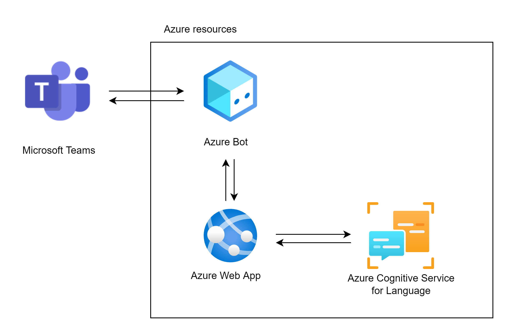

# Building a Question-and-Answering bot for Teams

It is common to have a body of information and wanting to find specific information, but looking through heaps of documents is long and tedious. What if you could create a Teams bot that listened to questions and responded to these based on the information in the documents? By using `Azure Cognitive Service for Language Custom Question and Answering` and `Azure Bot`, it is possible to do exactly that.

Here is a diagram of the architecture of Azure resources required for this project:

Explanation of the resources:
* `Microsoft Teams`: Provides the user interface with which the end user will interact. Through a chat, a user will be able to ask questions and receive responses from the knowledge-base.
* `Azure Bot`: This Azure resource provides access to Channels (such as web chat, Microsoft Teams, etc.), stores the configuration and provides authentication for the channel.
* `Azure Web App`: Hosts the chatbot built with the Bot Framework SDK. This chatbot provides a REST API that the Azure Bot will communicate with. The Azure Bot will send requests with message information to the chatbot web app, and the chatbot web app will respond to these.
* `Azure Cognitive Service for Language`: This Azure resource will allow us to upload our documents that will form our knowledge base. This resource will automatically extract question and answer pairs. Then, it will provide an API to query questions and receive their corresponding responses. It is used by the chatbot to provide answers to questions.

## Steps

### 1. Build a Knowledge Base using Custom Question and Answering

1. In a new resource group for this project, create a `Language service` resource, **enabling Custom question answering** as custom feature

    

    
Screenshot

    
    

2. From your newly created resource, navigate to the [Language Studio](https://language.cognitive.azure.com/home). Create a new `Custom question answering` project.

    

    
Screenshots

    
    
    

3. Add a source for your knowledge base (can be URLs, Files, Chitchat)

    

    
Screenshot

    
    

4. Once the Question answer pairs are extracted from your documents, test it out.

    

    
Screenshot

    
    

5. Deploy your knowledge base

    

    
Screenshot

    
    

### 2. Build an Azure Bot from your Knowledge Base

1. From step 5 (deployment of the knowledge base), Azure provides a button to `Create a bot`. This is the most convenient way to create a bot for your knowledge base as it will:
    1. Create an `Azure Bot` resource.
    2. Scaffold a `Bot Framework SDK` solution that receives API requests, calls the `Language Studio Custom question answering API` that we just created, and responds using the response it gets from `Language Studio Custom question answering`
    3. Deploy the scaffolded solution to a web app for hosting.
    4. Create the Microsoft App ID and password for the Bot permissions

        

        
Screenshot

        
        

2. In the `Azure Bot` resource, test that the bot is working using the `Test in Web Chat` tab.

    

    
Screenshot

    
    

3. Enable the Teams channel in the `Channels` tab. From here, you can `Open in Teams` for testing purposes as shown in the screenshot.

    

    
Screenshot

    
    

4. In the `Configuration` tab, retrieve the Microsoft App ID. You will need this value for later.

    

    
Screenshot

    
    

5. [Bonus] You can also download the source code for the Bot Framework SDK chatbot that was scaffolded by Azure from the `Overview` page.

    

    
Screenshot

    
    

### 3. Create a Teams Bot

In order to create a Teams bot accessible to your organization, you will need to create a Teams app.

1. Install the [App Studio from the Teams Store](https://aka.ms/InstallTeamsAppStudio).

    

    
Screenshot

    
    

2. Create a new app, filling in the required information for the `App details` tab.

    

    
Screenshot

    
    

3. In the `Bots` tab, set up a bot. Select `Existing bot`, `Connect to a different bot id` and enter the Microsoft App ID you wrote down from step 2.4, and set the `Scope` as personal.

    

    
Screenshot

    
    

4. Finally, in the `Test and distribute` tab, you can `Install your app in Teams` for testing, `Download the app package zip file` for distribution or `Publish your app` to your app to your Teams organization or to Microsoft AppSource.

    

    
Screenshot

    
    

## Resources
1. [Create, test, and deploy a custom question answering project](https://docs.microsoft.com/en-us/azure/cognitive-services/language-service/question-answering/how-to/create-test-deploy)
2. [Tutorial: Create a FAQ bot
](https://docs.microsoft.com/en-us/azure/cognitive-services/language-service/question-answering/tutorials/bot-service)
3. [Tutorial: Extend to Microsoft Teams](https://microsoft.github.io/botframework-solutions/clients-and-channels/tutorials/enable-teams/1-intro/)